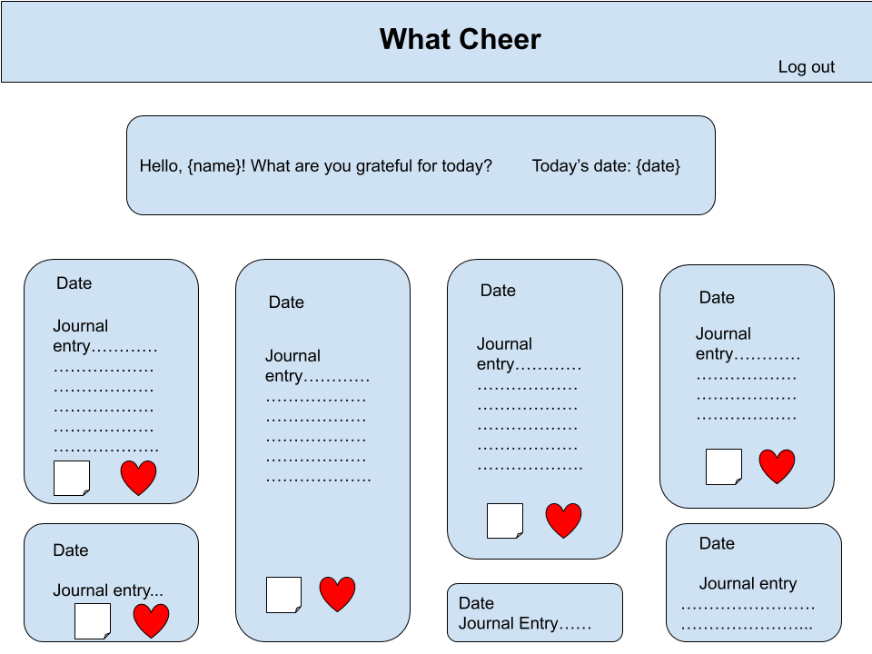
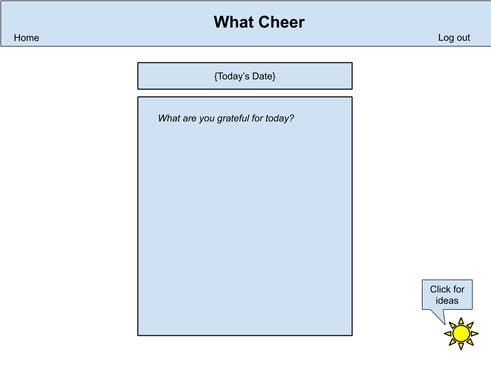
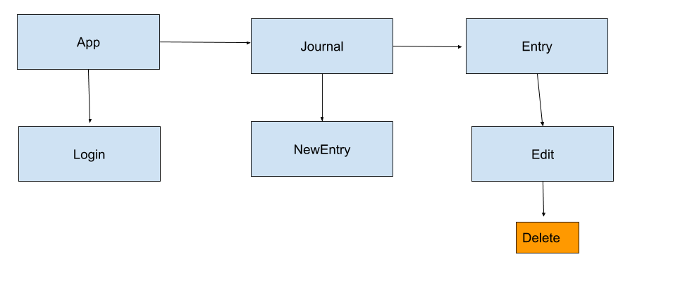

# What Cheer :sunny:

What Cheer is a gratitude journal. Gratitude journaling has shown an ability to improve the author’s happiness and life satisfaction, reduce stress levels, and reduce depressive symptoms. We are constantly bombarded with negativity from our TVs, our news feeds, and the people we interact with daily. In today’s fast-paced world, What Cheer lets users slow down, practice mindfulness, and reflect on the positive aspects of their lives. 

This app is being built by Chris Wargo and Asha Misra

## User Stories

- As a user, I want to be able to add a daily entry in my gratitude journal.
- As a user, I want to be able to go back and add entries for days I missed.
- As a user, I want my entries to be private, so only I can access them.
- As a user, I might have trouble coming up with something to write about, and having prompts would be helpful.
- As a user, I’d like to be reminded to write a journal entry every day.

## Wireframes

What Cheer home page

What Cheer create page 

Planned components

## Django Models

- Entry model 
    - date, entry, (post-MVP: image(file), song)  
- Prompt model 
    - prompt
- User 
    - username, email, password

## Django API endpoints

- GET entries/
- GET entries/<int:pk>/
- PUT entries/<int:pk>/edit/
- POST entries/create/
- DELETE entries/<int:pk>/

## MVP and Stretch Goals

- [ ] Entry model
- [ ] User model
- [ ] Prompt model
- [ ] Users have ownership of entries
- [ ] Full CRUD
- [ ] social auth - facebook and google
- [ ] Unit testing
- [ ] basic CSS design & responsiveness
- [ ] Push notifications (satisfies requirement for something we didn't learn in class)

post-MVP:
- [ ] File transfer to google drive or download to save entries
- [ ] Bootstrap
- [ ] Add a song to an entry
- [ ] Image upload on entries
- [ ] Switch frontend to React Native
- [ ] Social media share

